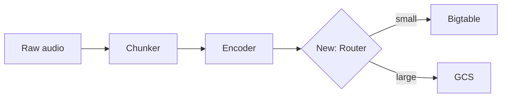
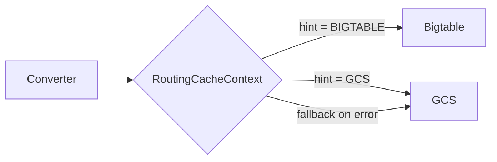

# Pull Request の作成・更新

PR description はレビュアーの注意を管理するためにある。
レビュー速度に最適化する: 良い description は diff を開く前の 30 秒で「何が変わったか、なぜか、どこから読めばよいか」をレビュアーに伝える。

# 絶対禁止事項

NEVER:

- コミットに `Co-Authored-By` ヘッダを付けない
- "Generated with Claude Code" その他 AI/Claude 帰属を含めない
- PR 内のどこにも Claude / AI / エージェント / アシスタントへの言及を入れない

# 下書き前に PROSE.md を読む

このスキルディレクトリの `PROSE.md` が存在すれば、PR 本文を書く前に読む。
PR description は prose（散文）であり、PROSE.md のルールはそのまま適用される。
PR で特に効くもの:

- 能動態・現在形を使う。"X overrides Y" であって "Y is overridden by X" ではない
- 冗長な語を削除する。"in order to", "the fact that", "rather", "quite", "very" などのヘッジは切る
- キーワードを前置する。各段落と見出しの最初の2語に最重要語を置く
- 太字は控えめに（Von Restorff 効果）。Reviewer notes の各項目で太字は1つだけ。全部太字にすると何も目立たない
- 具体 > 抽象。"showed `71 / 113 63%` instead of `71 / 160 44%`" は「インフレした割合を示した」より刺さる
- 段落は 2–4 行。長すぎるブロックは飛ばされる。1 行断片では情報がまとまらない
- "In conclusion", "Overall", "In summary" は書かない。最後は次のアクションか最後の事実で締める

# タイトル形式

能動態・現在形・対象範囲が完全であること。
言語ポリシー（英語 or 日本語）はリポジトリの visibility と `~/.claude/rules/commit.md` に従う。

| Good (英語) | Bad |
|------|-----|
| Add user authentication | Added user authentication |
| Fix memory leak in cache | Fixing memory leak |
| Use Redis cache for session lookup instead of DB query | Update session.py |

| Good (日本語) | Bad |
|------|-----|
| ユーザー認証を追加 | ユーザー認証の追加（体言止め） |
| キャッシュのメモリリークを修正 | キャッシュのメモリリーク修正中（進行形） |
| セッション参照を DB から Redis キャッシュに変更 | session.py を更新 |

パターン: `<動詞> <対象> [in/for/to <文脈>]`

英語でよく使う動詞: Add, Fix, Update, Remove, Refactor, Implement, Improve, Replace, Enable, Disable, Use, Make。
日本語: 追加、修正、更新、削除、リファクタ、実装、改善、置換、有効化、無効化、使用、変更。

ユーザー環境では gitmoji + Conventional type を付ける運用なので `✨ feat: Add user authentication` 形式が標準（`~/.claude/rules/commit.md` 参照）。

# Above-the-fold（スクロール前）契約

レビュアーは上から読み下し、どこに注意を投下するかを判断する。
最初のスクロール前に表示される内容は、レビュアーを完全にオリエンテーションさせる必要がある。

1. タイトル → 1行で対象範囲全体を表す。タイトルだけ読んだレビュアーが「コードベースのどの領域がどう変わったか」を分かる
2. TL;DR → 症状 + 修正を 2 文で、具体的な数値や例とともに。TL;DR だけ読めば低リスク PR は承認できる
3. Files 表 → どこから読み始めればよいか、各ファイルがなぜ重要か。Files 表だけ読めばレビュー順と各ファイルの観点が分かる

TL;DR が 2 文に綺麗に収まらないなら、まだ PR を理解できていない。
diff を読み直す。

# Description テンプレート

テンプレートは1つ、セクションは柔軟。価値を加えるセクションだけ使い、加えないセクションは省く。
ルール: 「そのセクションを消してもレビュアーが遅くならないなら、消す」。

```markdown
## TL;DR

[2 文。1文目は具体的な数値・エラー・例で問題を名指す。
2文目は PR がそれに対して何をするかを名指す。]

**Files to review (N, +X / -Y):**

| File | Why |
|---|---|
| `path/to/start_here.py` *(start here)* | 自然な入口を1行で指す |
| `path/to/other.py` | このファイルが変わった理由を短く |

## Why

[PR が存在する理由。エラーメッセージ、誤った出力、欠落した機能など問題を示す。
差分が視覚的・数値的なら before/after 表やスクリーンショットを使う。
TL;DR が「なぜ」を完全に説明している小さな PR ではこのセクション自体を省く — 繰り返さない。]

## How

[変更の説明。トップダウンで。逐次的なロジックは番号付き、並列な変更は箇条書き。
行単位の説明ではなく、設計判断を書く。]

## Reviewer notes

[非自明な事実 1 つにつき 1 項目。各項目の見出しを太字に。]

- **`comparison_id` でマッチ、モデルペアではない。** Tier プロジェクトは
  ペアをテスト間で共有するため、モデルペアでマッチさせると結果が混線する
- **失敗時はグレースフルにフォールバック。** API 呼び出しが失敗すると
  ログを出してレガシーの分母を維持 — サイレント故障はない

## Visual aids

[空間を稼ぐ価値があるときだけ使う。下記「視覚補助の使い時」を参照。
Mermaid 図、before/after 表、コードスニペット、スクリーンショット。]

## Tests

[何をカバーしたか、何をしていないか、実行方法。]

## Follow-up

[この PR が下準備した、スコープ外の作業。任意 —
PR が意図的に未完成なときだけ書く。]

## Links

- [Ticket](url)
- [Slack thread](url)
```

## テンプレートのスケーリング

小さな PR (約 50 行未満、1 関心):
TL;DR + Why (2–3 文) + Links。
Files 表、Reviewer notes、Tests は、diff から分からないことを補わない限り省く。

中規模 PR (50–200 行):
TL;DR + Files 表 + Why + How + Links。
Reviewer notes は非自明なトレードオフがある時だけ追加。

大規模 PR (200 行以上、または複数関心):
当てはまるすべてのセクションを使う。
Files 表と Reviewer notes は必須 — レビュアーには地図が要る。

# Diff を繰り返さない

diff はそこにある。
description の仕事は diff には書けないことを説明すること: 動機、トレードオフ、コードの外にあるコンテキスト。

## 毎回切るもの

- ファイル単位のナレーション。「`foo.py` で X を変えた。`bar.py` で Y を変えた。」
  Files 表が各ファイル 1 行で済ませ、diff が残りを示す
- How の箇条書きが Files 表を言い換えているだけ。
  How にファイル単位の箇条書きがあり、それが Files 表の内容を多くの語で繰り返しているなら切る。
  How は共有設計、つまりファイル横断のパターンを書くべきで、各ファイルのツアーではない
- 実装の play-by-play。「まずヘルパー関数を追加した。次にそれを呼んだ…」
  設計を書く、手順を書かない
- レビュアーが既に知っている動機。
  チケット/issue が問題を完全に説明しているなら、リンクして 1 文書く — チケット全文を再述しない
- 自明な型/シグネチャ変更の言い換え。「`foo(x: int)` を `foo(x: float)` に変えた」
  diff に映っている。なぜ変えたかを書く
- 防衛的な免責。「first pass です」「suggestions welcome」「これで良いか確信がない」
  確信がないなら PR を開く前に解決する。
  特定の質問があれば Reviewer notes に書く
- コミットメッセージの考古学。「最初のコミットで X、次のコミットで Y」
  最終状態を書く

## テスト: この文は diff に存在するか?

description の各文に対して問う: レビュアーが diff を読めばこれが分かるか?
Yes なら切る。
description は diff の補完であって、要約ではない。

# 視覚補助の使い時

視覚補助は散文より速く伝わるときに空間を獲得する。
飾らない、説明する。

## Before/After 表

PR が観測可能な動作（出力フォーマット、API レスポンス形状、メトリクス値、エラーメッセージ）を変えたときに使う。

```markdown
| | Before | After |
|---|---|---|
| Progress display | `71 / 113  63%` | `71 / 160  44%` |
| Completion trigger | Fires at 113 annotations | Fires at 160 annotations |
```

## Mermaid 図

PR がデータフローを変えるとき、パイプラインに段を追加するとき、コンポーネントの相互作用を再構築するときに使う。
変わっていないものは図にしない。

````markdown

````

## コードスニペット

PR が public API 表面を変え、レビュアーが diff を漁らずに新しい呼び出し側やシグネチャを見たいときに使う。

````markdown
Before:
```python
result = process(audio, sample_rate=44100)
```

After:
```python
result = process(audio, config=ProcessConfig(sample_rate=44100, normalize=True))
```
````

## スクリーンショット / ターミナル出力

UI 変更、CLI 出力の変更、ログフォーマットの変更で使う。
画像やターミナルブロックをそのまま貼る — 散文で見た目を説明しない。

## 視覚補助を使わない時

- 変更が純粋に内部的（リファクタ、リネーム、テストのみ）。
  変わっていないアーキテクチャの図は空間の無駄
- "Before" 状態が自明。
  1 行のバグ修正に before/after 表はオーバーヘッド
- システム全体を図にしている。
  PR が変えた範囲だけを図にする、触っただけの範囲を図にしない

# レビュアー親和性チェックリスト

提出前に確認:

- [ ] タイトル → これだけ読めば対象範囲全体が分かる
- [ ] TL;DR → これだけ読めば症状 + 修正が分かる
- [ ] Files 表 → 自然な入口があれば 1 ファイルを "start here" とマーク
- [ ] diff のエコーなし → すべての文が diff には書けないことを伝える
- [ ] 視覚補助 → 散文より速いところに置く、そうでないところには置かない
- [ ] Reviewer notes → 各項目は、レビュアーがそうでなければ立ち止まって聞くであろう質問に答える

# プロセス

## 1. 検出: 作成 or 更新?

```bash
# このブランチに PR があれば、これは更新。
gh pr view --json number,title,body,baseRefName,url 2>/dev/null
```

## 2. コンテキスト収集

```bash
BASE=$(gh pr view --json baseRefName -q '.baseRefName' 2>/dev/null || echo "main")

git diff $BASE...HEAD          # フル diff — PR が表現するもの
git diff $BASE...HEAD --stat   # 形: ファイル、+/- 数
git log $BASE..HEAD --oneline  # コミット群
```

stat ではなく実際の diff を読む。
description は今のコードが何をするかを反映する。

## 3. リンクを探す

description の中で「~ステップ後に divergence が出た」「legal がトークン保存をフラグした」のようにレビュアーが検証したくなる主張には、すべてリンクが必要。
レビュアーに事実を信用させない。

ユーザーに聞く前に能動的に探す:

1. Git 履歴。`git log --all --oneline --grep="keyword"` で関連 PR、修正コミット、revert を探す
2. Slack。エラーメッセージ、機能名、インシデントキーワードで検索する。
   何かが起きたと最初に気付いたスレッドではなく、原因が特定されたスレッドにリンクする
3. issue tracker。機能・バグ・コード領域に言及するチケットを検索
4. ブランチ名とコミット。チケット番号やキーワードがここに潜んでいることが多い

自分で見つけられないもの（プライベート文書、外部ダッシュボード、ジョブ実行 ID 等）だけユーザーに聞く。

更新時は既存 description のリンクをすべて保存する。

## 4. 下書き

最初に diff を読む。
TL;DR をスケッチする — これは構造に進む前に明確さを強制する。
次にどのオプションセクションが空間を獲得するか決める。

PROSE.md を適用する。
各文を「これは diff に存在するか?」テストで確認する。

## 5. 適用

```bash
gh pr create --title "..." --body "$(cat <<'EOF'
...
EOF
)"

gh pr edit <number> --title "..." --body "$(cat <<'EOF'
...
EOF
)"
```

# 既存 PR の更新

description は base に対するブランチの現在の完全状態を反映する — 最後の push 以降の変更ログではない。
「also adds」「additionally」「now includes」を切る。
新規 PR を書くつもりで「PR が今何をするか」を描写する。

Bad (changelog):
> "This PR now also adds a circuit breaker pattern…"

Good (現在状態):
> "HTTP requests to external services fail under load. This PR wraps the HTTP client with exponential backoff retry and a circuit breaker…"

# 実例

## 小さな PR: 1 関心のバグ修正

Title: `Fix off-by-one in chunk boundary calculation`

```markdown
## TL;DR

Chunking a 10-second stereo clip at 5-second boundaries produced three chunks
instead of two — the final chunk contained a single repeated sample.
`_compute_boundaries` now uses exclusive end indices.

## Why

The boundary loop used `<=` instead of `<` for the end condition, so a clip
whose length exactly divided the chunk size generated a zero-length trailing
chunk that round-up logic then padded to one sample.

## Links

- [DIFF-1234](url)
```

Files 表なし（変更は 2 ファイル、diff から自明）。
Reviewer notes なし（素直な修正）。
視覚補助なし（before/after は演算子 1 つ）。

## 視覚補助を伴う非自明 PR

Title: `Route small converter outputs to Bigtable instead of GCS`

```markdown
## TL;DR

Converter cache reads for small features (< 50 kB) hit GCS with per-object
latency — p50 of 45 ms per read adds up to ~8 minutes per preprocessing job
on a 10k-track dataset. This PR adds a `RoutingCacheContext` that sends small
features to Bigtable (p50: 3 ms) and keeps large features on GCS.

**Files to review (5, +287 / -34):**

| File | Why |
|---|---|
| `core/utils/caching.py` *(start here)* | New `RoutingCacheContext` — all routing logic lives here. |
| `core/constants.py` | `FeatureSizeHint` enum and Bigtable constants. |
| `converters/base.py` | Converters declare `feature_size_hint`. |
| `tests/.../test_routing_cache.py` *(new)* | 12 tests covering routing, fallback, and threshold edge cases. |
| `kubernetes/bigtable/bigtable.yaml` | Column family for converter cache. |

## Why

| | GCS (current) | Bigtable (this PR) |
|---|---|---|
| p50 read latency | 45 ms | 3 ms |
| 10k-track job overhead | ~8 min | ~30 sec |
| Cost per 1M reads | $0.50 | $0.12 |

Small features (audio metadata, caption embeddings) are 2–30 kB — well under
Bigtable's 10 MB cell limit and a poor fit for GCS's per-object overhead.

## How

1. Converters declare `feature_size_hint = FeatureSizeHint.BIGTABLE` or `.GCS`.
2. `RoutingCacheContext` wraps both `BigtableCacheContext` and `GCSCacheContext`.
3. On read/write, routes by the converter's declared hint.



## Reviewer notes

- **Fallback on Bigtable failure.** If a Bigtable write fails, the router
  retries once, then falls back to GCS and logs a warning. Reads check both
  backends. No silent data loss.
- **Threshold is declared, not measured.** Converters declare their hint
  statically. Runtime size checks would add latency and complexity for
  marginal benefit — the outputs are stable sizes.
- **No migration needed.** Existing GCS cache entries stay. New writes go to
  the declared backend. Over time, Bigtable fills in as jobs re-run.

## Tests

12 new tests in `test_routing_cache.py`: routing logic, fallback on Bigtable
error, threshold boundary (49 kB vs 51 kB), round-trip read/write for both
backends.

## Links

- [DIFF-5678](url)
- [Bigtable capacity planning](url)
```

# 最終チェック

- タイトル: 能動態・現在形・対象範囲全体を含む
- TL;DR: 2 文、具体的な数値/例、症状 + 修正をカバー
- Files 表（あれば）: "start here" のエントリーポイントをマーク
- すべての文が「diff にない」テストを通過
- 視覚補助: 散文より速いところに含め、装飾になるところには含めない
- 各 Reviewer note: 太字見出し 1 つ、非自明な事実 1 つ
- `Co-Authored-By` なし、"Generated with…" なし、AI/Claude 言及なし
- 更新時はリンクを保存
- description は現在状態を描写、変更ログではない
